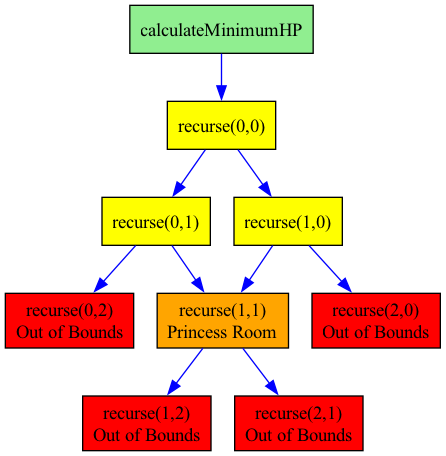

# Dungeon Game Tests

This repository contains unit tests for the DungeonGame C++ implementation.

The visual callgraph shows the tree structure with:
- 🟢 **Green**: Entry point (`calculateMinimumHP`)
- 🟡 **Yellow**: Recursive calls exploring valid cells
- 🟠 **Orange**: Princess room (destination)
- 🔴 **Red**: Out-of-bounds calls (pruned)


## Files

- `dungeon-game.cpp` - Original dungeon game implementation
- `simple_tests.cpp` - Self-contained unit tests with custom test framework
- `callgraph_generator.cpp` - Generates call traces and visual callgraphs
- `Makefile` - Build automation
- `CMakeLists.txt` - CMake build configuration

## Running Tests

### Simple Tests (No external dependencies)

The simple tests use a custom lightweight test framework and don't require any external libraries:

```bash
# Compile and run simple tests
make test
```

Or manually:
```bash
clang++ -std=c++11 -Wall -Wextra -g -o simple_tests simple_tests.cpp
./simple_tests
```

### Using CMake
```bash
mkdir build
cd build
cmake ..
make
./simple_tests
```

## Generating Callgraphs

You can generate detailed call traces and visual callgraphs to understand how the algorithm executes:

### Generate Call Trace
```bash
# Generate text trace of function calls
make callgraph
cat callgraph_trace.txt
```

### Generate Visual Callgraph
First install Graphviz (for visualization):
```bash
# On macOS with Homebrew
brew install graphviz

# On Ubuntu/Debian
sudo apt-get install graphviz
```

Then generate the visual callgraph:
```bash
# Generate PNG and SVG callgraph images
make callgraph-viz

# Or manually:
dot -Tpng callgraph.dot -o callgraph.png
dot -Tsvg callgraph.dot -o callgraph.svg
```

### Example Callgraph Output

For a 2x2 dungeon:
```
  [-3,  5]
  [ 1, -4]
```

The call trace shows:
1. `calculateMinimumHP` starts the process
2. `recurse(0,0)` explores from top-left
3. Explores both right `(0,1)` and down `(1,0)` paths
4. Eventually reaches princess room `(1,1)` 
5. Uses memoization to avoid recalculation
6. Returns minimum HP needed: **4**

## Test Cases Covered

The tests cover the following scenarios:

1. **Basic functionality** - Standard dungeon traversal
2. **Edge cases** - Single cell dungeons with positive/negative/zero values
3. **Boundary conditions** - Single row/column dungeons
4. **All positive values** - Should return minimum health of 1
5. **All negative values** - Tests worst-case scenario
6. **Mixed values** - Realistic dungeon configurations
7. **Princess room scenarios** - Large positive/negative values in destination
8. **Optimal path planning** - Cases where path choice matters
9. **Performance** - Large grids to verify memoization efficiency
10. **Result validation** - Ensures minimum health is always positive

## Algorithm Description

The DungeonGame class implements a dynamic programming solution to find the minimum initial health points needed to reach the princess. The algorithm:

1. Uses memoization to avoid recalculating subproblems
2. Works backwards from the destination
3. At each cell, calculates the minimum health needed considering both possible moves (right and down)
4. Ensures the knight never has health ≤ 0 during the journey

## Expected Test Results

When all tests pass, you should see output similar to:
```
✓ PASS: Basic example (expected: 3, got: 3)
✓ PASS: Single cell negative (expected: 6, got: 6)
✓ PASS: Single cell positive (expected: 1, got: 1)
...
=== Test Summary ===
Passed: 14
Failed: 0
Total: 14
All tests passed! ✓
```
